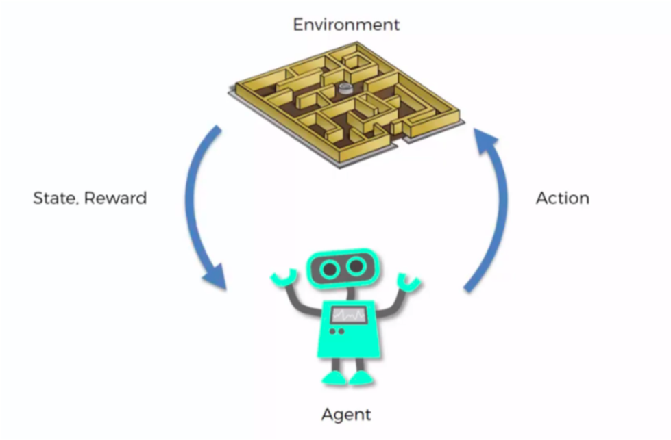
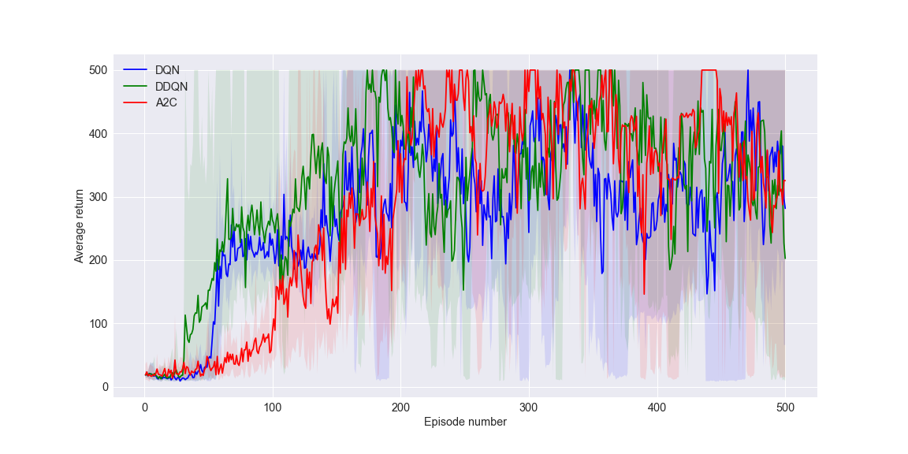
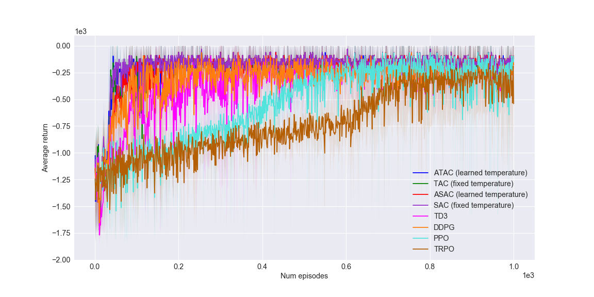

# Deep Reinforcement Learning (DRL) Algorithms with PyTorch



This repository contains PyTorch implementations of deep reinforcement learning algorithms. This implementation uses PyTorch. For a TensorFlow implementation of algorithms, take a look at [tsallis_actor_critic_mujoco](https://github.com/rllab-snu/tsallis_actor_critic_mujoco).

## Algorithms Implemented

1. Deep Q-Network (DQN) <sub><sup> ([V. Mnih et al. 2015](https://storage.googleapis.com/deepmind-media/dqn/DQNNaturePaper.pdf)) </sup></sub>
2. Double DQN (DDQN) <sub><sup> ([H. Van Hasselt et al. 2015](https://arxiv.org/abs/1509.06461)) </sup></sub>
3. Advantage Actor Critic (A2C)
4. Vanilla Policy Gradient (VPG)
5. Natural Policy Gradient (NPG) <sub><sup> ([S. Kakade et al. 2002](http://papers.nips.cc/paper/2073-a-natural-policy-gradient.pdf)) </sup></sub>
6. Trust Region Policy Optimization (TRPO) <sub><sup> ([J. Schulman et al. 2015](https://arxiv.org/abs/1502.05477)) </sup></sub>
7. Proximal Policy Optimization (PPO) <sub><sup> ([J. Schulman et al. 2017](https://arxiv.org/abs/1707.06347)) </sup></sub>
8. Deep Deterministic Policy Gradient (DDPG) <sub><sup> ([T. Lillicrap et al. 2015](https://arxiv.org/abs/1509.02971)) </sup></sub>
9. Twin Delayed DDPG (TD3) <sub><sup> ([S. Fujimoto et al. 2018](https://arxiv.org/abs/1802.09477)) </sup></sub>
10. Soft Actor-Critic (SAC) <sub><sup> ([T. Haarnoja et al. 2018](https://arxiv.org/abs/1801.01290)) </sup></sub>
11. Automating entropy adjustment on SAC (ASAC) <sub><sup> ([T. Haarnoja et al. 2018](https://arxiv.org/abs/1812.05905)) </sup></sub>
12. Tsallis Actor-Critic (TAC) <sub><sup> ([K. Lee et al. 2019](https://arxiv.org/abs/1902.00137)) </sup></sub>
13. Automating entropy adjustment on TAC (ATAC)

## Environments Implemented

1. CartPole-v1 <sub><sup> (as described in [here](https://gym.openai.com/envs/CartPole-v1/)) </sup></sub>
2. Pendulum-v0 <sub><sup> (as described in [here](https://gym.openai.com/envs/Pendulum-v0/)) </sup></sub>
3. MuJoCo environments (HalfCheetah-v2, Ant-v2, Pusher-v2, Humanoid-v2, etc.) <sub><sup> (as described in [here](https://gym.openai.com/envs/#mujoco)) </sup></sub>

## Results

### CartPole



### Pendulum



### HalfCheetah

### Ant

### Pusher

### Humanoid

## Usage

The repository's high-level structure is:

    ├── agents                    
        └── common 
    ├── results  
        ├── data 
        └── graphs        
    ├── tests
        └── save_model

### 1) To train the agents on the environments

To train all the different agents on MuJoCo environments, follow these steps:

```commandline
git clone https://github.com/dongminlee94/deep_rl.git
cd deep_rl
python run_mujoco.py
```

For other environments, change the last line to `run_cartpole.py`, `run_pendulum.py`.

If you want to change configurations of the agents, follow this step:
```commandline
python run_mujoco.py --env=Humanoid-v2 --algo=tac --seed=1
```

### 2) To watch the learned agents on the above environments

To watch all the learned agents on MuJoCo environments, follow these steps:

```commandline
cd tests
python mujoco_test.py --load=env_name/algo_name/...
```

You should copy the saved model name in `tests/save_model/env_name/algo_name/...` and paste the copied name in `...`. So the saved model will be load.